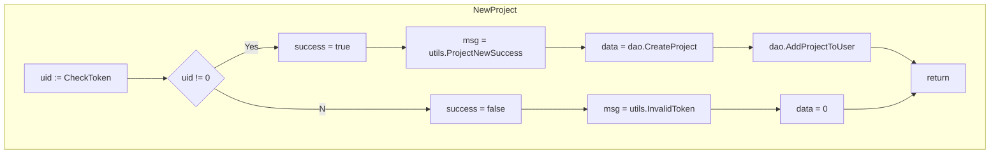
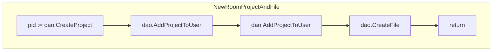
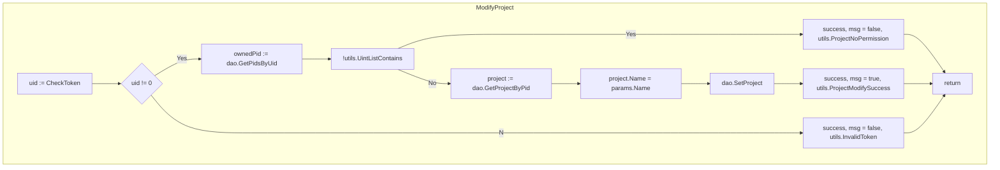
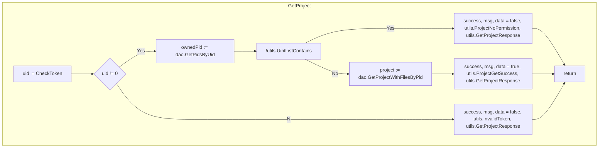
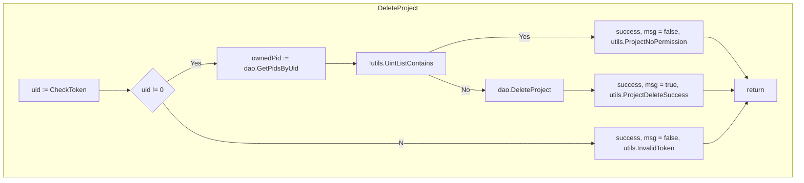
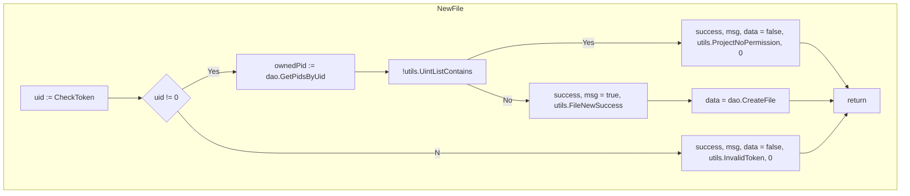
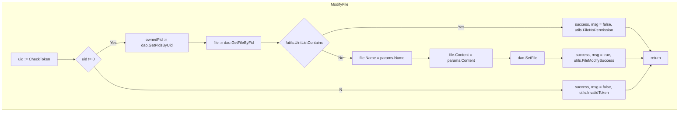
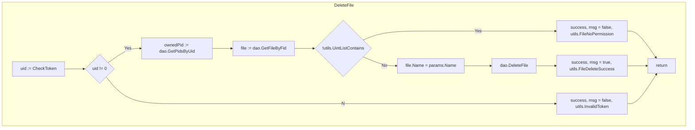

# ProjectService

## NewProject

```mermaid
graph TD

subgraph NewProject
	s1[uid := CheckToken] --> c1{uid != 0}
	c1 --Yes--> s2[success = true]
	s2 --> s3[msg = utils.ProjectNewSuccess]
	s3 --> s4[data = dao.CreateProject]
	s4 --> s5[dao.AddProjectToUser]
	c1 --No--> s6[success = false]
	s6 --> s7[msg = utils.InvalidToken]
	s7 --> s8[data = 0]
	s5 --> s9[return]
	s8 --> s9
end
```

## NewRoomProjectAndFile

```mermaid
graph TD

subgraph NewRoomProjectAndFile
	s1[pid := dao.CreateProject] --> s2[dao.AddProjectToUser]
	s2 --> s3[dao.AddProjectToUser]
	s3 --> s4[dao.CreateFile]
	s4 --> return
end
```

## ModifyProject

```mermaid
graph TD

subgraph ModifyProject
	s1[uid := CheckToken] --> c1{uid != 0}
	c1 --Yes--> s2[ownedPid := dao.GetPidsByUid]
	s2 --> c2[!utils.UintListContains]
	c2 --Yes--> s3[success, msg = false, utils.ProjectNoPermission]
	c2 --No --> s4[project := dao.GetProjectByPid]
	s4 --> s5[project.Name = params.Name]
	s5 --> s6[dao.SetProject]
	s6 --> s7[success, msg = true, utils.ProjectModifySuccess]
	c1 --No-->s8[success, msg = false, utils.InvalidToken]
	s3 --> s9[return]
	s7 --> s9
	s8 --> s9
end
```

## GetProject

```mermaid
graph TD

subgraph GetProject
	s1[uid := CheckToken] --> c1{uid != 0}
	c1 --Yes--> s2[ownedPid := dao.GetPidsByUid]
	s2 --> c2[!utils.UintListContains]
	c2 --Yes--> s3[success, msg, data = false, utils.ProjectNoPermission, utils.GetProjectResponse]
	c2 --No --> s4[project := dao.GetProjectWithFilesByPid]
	s4 --> s5[success, msg, data = true, utils.ProjectGetSuccess, utils.GetProjectResponse]
	c1 --No-->s8[success, msg, data = false, utils.InvalidToken, utils.GetProjectResponse]
	s3 --> s9[return]
	s5 --> s9
	s8 --> s9
end

```

## DeleteProject

```mermaid
graph TD

subgraph DeleteProject
	s1[uid := CheckToken] --> c1{uid != 0}
	c1 --Yes--> s2[ownedPid := dao.GetPidsByUid]
	s2 --> c2[!utils.UintListContains]
	c2 --Yes--> s3[success, msg = false, utils.ProjectNoPermission]
	c2 --No --> s4[dao.DeleteProject]
	s4 --> s5[success, msg = true, utils.ProjectDeleteSuccess]
	c1 --No-->s8[success, msg = false, utils.InvalidToken]
	s3 --> s9[return]
	s5 --> s9
	s8 --> s9
end
```

## NewFile

```mermaid
graph TD

subgraph NewFile
	s1[uid := CheckToken] --> c1{uid != 0}
	c1 --Yes--> s2[ownedPid := dao.GetPidsByUid]
	s2 --> c2[!utils.UintListContains]
	c2 --Yes--> s3[success, msg, data = false, utils.ProjectNoPermission, 0]
	c2 --No --> s4[success, msg = true, utils.FileNewSuccess]
	s4 --> s5[data = dao.CreateFile]
	c1 --No-->s8[success, msg, data = false, utils.InvalidToken, 0]
	s3 --> s9[return]
	s5 --> s9
	s8 --> s9
end

```

## ModifyFile

```mermaid
graph TD

subgraph ModifyFile
	s1[uid := CheckToken] --> c1{uid != 0}
	c1 --Yes--> s2[ownedPid := dao.GetPidsByUid]
	s2 --> s3[file := dao.GetFileByFid]
	s3 --> c2{!utils.UintListContains}
	c2 --Yes-->s4[success, msg = false, utils.FileNoPermission]
	c2 --No -->s5[file.Name = params.Name]
	s5 --> s6[file.Content = params.Content]
	s6 --> s7[dao.SetFile]
	s7 --> s8[success, msg = true, utils.FileModifySuccess]
	c1 --No-->s9[success, msg = false, utils.InvalidToken]
	s4 --> s10[return]
	s8 --> s10
	s9 --> s10
end
```

## DeleteFile

```mermaid
graph TD

subgraph DeleteFile
	s1[uid := CheckToken] --> c1{uid != 0}
	c1 --Yes--> s2[ownedPid := dao.GetPidsByUid]
	s2 --> s3[file := dao.GetFileByFid]
	s3 --> c2{!utils.UintListContains}
	c2 --Yes-->s4[success, msg = false, utils.FileNoPermission]
	c2 --No -->s5[file.Name = params.Name]
	s5 --> s7[dao.DeleteFile]
	s7 --> s8[success, msg = true, utils.FileDeleteSuccess]
	c1 --No-->s9[success, msg = false, utils.InvalidToken]
	s4 --> s10[return]
	s8 --> s10
	s9 --> s10
end
```