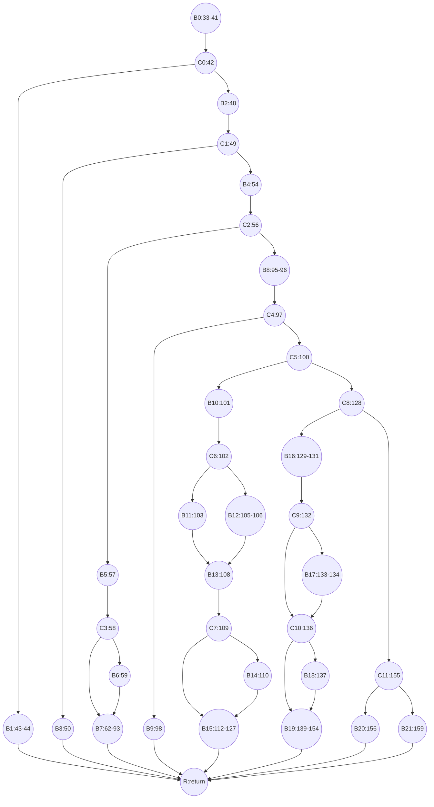
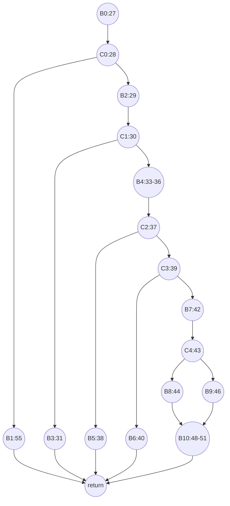

# DD-路径

## HandleRoom

```mermaid
graph TD
B0((B0:33-41)) --> C0((C0:42))
C0 --> B1((B1:43-44)) --> R((R:return))
C0 --> B2((B2:48))
B2 --> C1((C1:49))
C1 --> B3((B3:50)) --> R
C1 --> B4((B4:54))
B4 --> C2((C2:56))

C2 --> B5((B5:57))
B5 --> C3((C3:58)) --> B7
C3 --> B6((B6:59)) --> B7
B7((B7:62-93)) --> R

C2 --> B8((B8:95-96))
B8 --> C4((C4:97))
C4 --> B9((B9:98)) --> R

C4 --> C5((C5:100))
C5 --> B10((B10:101))
B10 --> C6((C6:102))
C6 --> B11((B11:103)) --> B13
C6 --> B12((B12:105-106)) --> B13
B13((B13:108)) --> C7((C7:109)) --> B15
C7 --> B14((B14:110)) --> B15
B15((B15:112-127)) --> R

C5 --> C8((C8:128))
C8 --> B16((B16:129-131))
B16 --> C9((C9:132)) --> C10
C9 --> B17((B17:133-134)) --> C10
C10((C10:136)) --> B19
C10 --> B18((B18:137)) --> B19
B19((B19:139-154)) --> R

C8 --> C11((C11:155))
C11 --> B20((B20:156)) --> R

C11 --> B21((B21:159)) --> R
```

## NewCommand

```mermaid
graph TD
B0((B0:27)) --> C0((C0:28))
C0 --> B1((B1:55)) --> R((return))
C0 --> B2((B2:29))
B2 --> C1((C1:30))
C1 --> B3((B3:31)) --> R
C1 --> B4((B4:33-36))
B4 --> C2((C2:37))
C2 --> B5((B5:38)) --> R
C2 --> C3((C3:39))
C3 --> B6((B6:40)) --> R
C3 --> B7((B7:42))
B7 --> C4((C4:43))
C4 --> B8((B8:44)) --> B10
C4 --> B9((B9:46)) --> B10
B10((B10:48-51)) --> R

```
