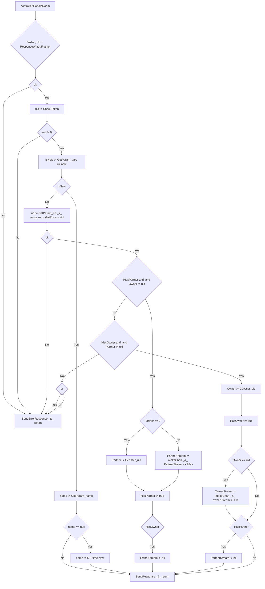
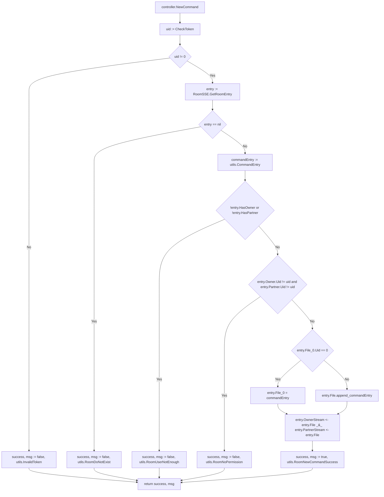

# 控制流图

## HandleRoom

```mermaid
graph TD
B0[controller.HandleRoom] --> B1{flusher, ok := ResponseWriter.Flusher};
B1 --> C0{ok}
C0 -- No --> B2[SendErrorResponse _&_ return];
C0 -- Yes --> B3[uid := CheckToken]
B3 --> C1{uid != 0}
C1 -- No --> B2
C1 -- Yes --> B4[isNew := GetParam_type == new]
B4 --> C2{isNew}

C2 -- Yes --> B5[name := GetParam_name]
B5 --> C3{name == null}
C3 -- Yes --> B6[name := R + time.Now]
C3 -- No --> B7[SendResponse _&_ return]
B6 --> B7

C2 -- No --> B8[rid := GetParam_rid _&_ entry, ok := GetRooms_rid]
B8 --> C4{ok} 
C4 -- No --> B2
C4 -- Yes --> C5{!HasPartner and <Partner == uid or Partner == 0> and Owner != uid}

C5 -- Yes --> C6{Partner == 0}
C6 -- Yes --> B9[Partner := GetUser_uid] --> B11
C6 -- No --> B10[PartnerStream := makeChan _&_ PartnerStream <- File>] --> B11
B11[HasPartner := true] --> C7
C7{HasOwner} -- Yes --> B12[OwnerStream <- nil]
B12 --> B7

C5 -- No --> C8{!HasOwner and <Owner == uid or Owner == 0> and Partner != uid}

C8 -- Yes --> B13[Owner := GetUser_uid]
B13 --> B16[HasOwner := true]
B16 --> C9{Owner == uid}
C9 -- Yes --> B14[OwnerStream := makeChan _&_ ownerStream <- File] --> C10
C9 -- No --> C10{HasPartner}
C10 -- Yes --> B15[PartnerStream <- nil] --> B7
C10 -- No -->B7


C8 -- No --> C11{<HasOwner and Owner == uid> or <HasPartner and Partner == uid>}

C11 -- Yes --> B2
C11 -- No --> B2

```

## NewCommand

```mermaid
graph TD
B0[controller.NewCommand] --> B1[uid := CheckToken]
B1 --> C0{uid != 0}
C0 -- No --> B2[success, msg := false, utils.InvalidToken]
B2 --> R[return success, msg]
C0 -- Yes --> B3[entry := RoomSSE.GetRoomEntry]
B3 --> C1{entry == nil}
C1 -- Yes --> B4[success, msg := false, utils.RoomDoNotExist] --> R
C1 -- No --> B5[commandEntry := utils.CommandEntry]
B5 --> C2{!entry.HasOwner or !entry.HasPartner}
C2 -- Yes --> B6[success, msg := false, utils.RoomUserNotEnough] --> R
C2 -- No --> C3{entry.Owner.Uid != uid and entry.Partner.Uid != uid}
C3 -- Yes --> B7[success, msg := false, utils.RoomNoPermission] --> R
C3 -- No --> C4{entry.File_0.Uid == 0}
C4 -- Yes --> B8[entry.File_0 = commandEntry] --> B10
C4 -- No --> B9[entry.File.append_commandEntry] --> B10
B10[entry.OwnerStream <- entry.File _&_ entry.PartnerStream <- entry.File]
B10 --> B11[success, msg := true, utils.RoomNewCommandSuccess] --> R
```
